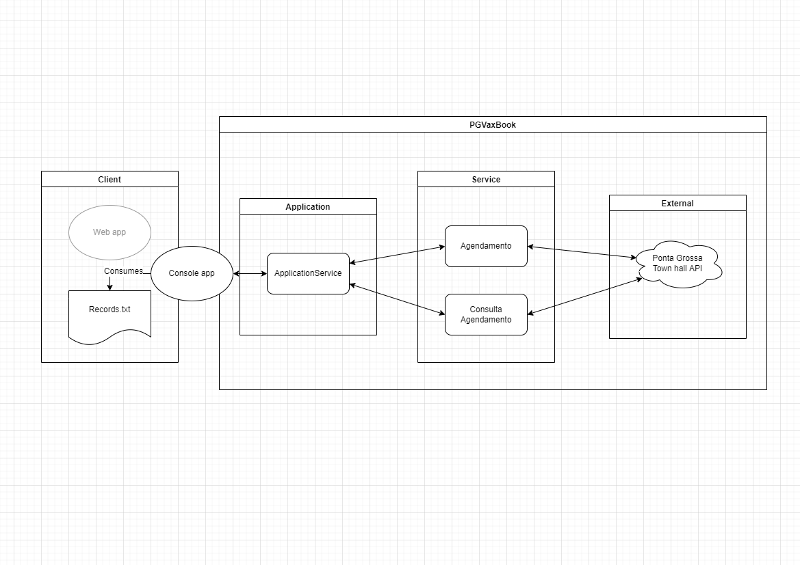

# Ponta Grossa Vaccination Appointments :syringe:

Application responsible to create an appointment or check the status of an apointment at Ponta Grossa Vaccination [website](https://fms.pontagrossa.pr.gov.br/vacinacao/).

## Table of Contents
 
-  [Table of Contents](#table-of-contents)
 
-  [Features :rocket:](#features-rocket)
 
-  [Requirements :wrench:](#requirements-wrench)
 
-  [Installation :gear:](#installation-gear)
 
-  [Usage :building_construction:](#usage-building_construction)
 
-  [Architecture :triangular_ruler:](#architecture-triangular_ruler)
 
-  [Support :construction_worker:](#support-construction_worker)
 
-  [Developers](#developers)

## Features :rocket:
 
- __Make an apointment:__
  - __A specific person__
  - __A a group of people__
 
- __Check an apointment:__
  - __A specific person__
  - __A a group of people__

## Requirements :wrench:
 
- Visual Studio 2022 ([download](https://visualstudio.microsoft.com/thank-you-downloading-visual-studio/?sku=Community&rel=17))
 
- Git ([download](https://git-scm.com/downloads))
 
- NET 6 ([download](https://dotnet.microsoft.com/download/))

## Installation :gear:
 
Open the cmd and execute: ```git clone https://github.com/wbail/PGVaxBook```
 
## Usage :building_construction:

- Development  
  1. Open the Visual Studio 2022
  2. Open the solution
  3. At `PGVaxBook\PGVaxBook.Presentation.Console\Properties\launchSettings.json` change the path to your file.
  4. Execute the application

- Production
  1. Download the the latest `.exe` file available in this repo: https://github.com/wbail/PGVaxBook/releases
  2. Download the text file: `records.txt`
  3. Replace the values with your information and save it
  4. Open a `cmd`
  5. Navigate where is located the `PGVaxBook.exe` file
  6. Execute: `PGVaxBook.exe C:\Path\To\records.txt`

## Architecture :triangular_ruler:
 

 
## Support :construction_worker:
 
In case of features or bugs, please contact me or open a PR 
 
### Developer(s)
 
- Guilherme Bail ([email](mailto:guilhermedanbail@gmail.com), [github](https://github.com/wbail))